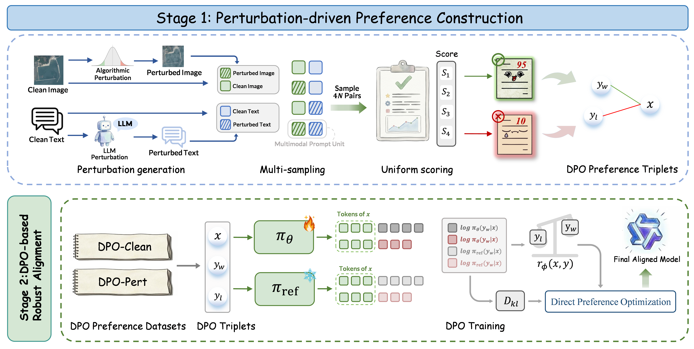

<div align="center">

# [RemoteShield: Enable Robust Multimodal Large Language Models for Earth Observation](https://arxiv.org/pdf/2604.17243)


[Rui Min (闵锐)*]()
, &nbsp; &nbsp; 
[Liang Yao (姚亮)*](https://1e12leon.top/) 
, &nbsp; &nbsp; 
[Shiyu Miao (缪师宇)*]()
, &nbsp; &nbsp; 
[Shengxiang Xu (徐圣翔)](https://xushengxianggg.github.io/) 
, &nbsp; &nbsp;

[Yuxuan Liu (刘宇轩)]()
, &nbsp; &nbsp; 
[Chuanyi Zhang (张传一)](https://ai.hhu.edu.cn/2023/0809/c17670a264073/page.htm) 
, &nbsp; &nbsp;
[Shimin Di (邸世民)](https://cs.seu.edu.cn/shimindi/main.htm) 
, &nbsp; &nbsp; 
[Fan Liu (刘凡)](https://multimodality.group/author/%E5%88%98%E5%87%A1/) ✉ 
, &nbsp; &nbsp;


\*  *Equal Contribution*    ✉ *Corresponding Author*

🤗 Model: [RemoteShield](https://huggingface.co/Stevehhh/RemoteShield)


</div>

## News
- **2026/04/21**: Welcome to **RemoteShield**. The preprint of our paper is available. Code is being organized and released in this repository.

## Introduction


A robust Multimodal Large Language Model (MLLM) for Earth Observation should possess the cognitive stability to maintain consistent interpretation and reasoning, regardless of the unpredictable perturbations encountered in real-world environments. However, current Remote Sensing MLLMs fundamentally fail to meet this requirement. Trained on carefully curated, high-quality "clean" datasets, they learn brittle mappings that do not generalize to the noisy and shifted conditions of operational Earth Observation. Consequently, their performance degrades when confronted with the noisy, imperfect inputs typical of actual deployment. To quantify and expose this vulnerability, we curate a comprehensive and realistic set of multimodal perturbations. These perturbations simulate environmental visual degradations, such as cloud and fog cover, together with diverse human-centric textual variation ranging from colloquialisms to vague or omitted instructions. Empirical evaluations reveal that these realistic perturbations significantly impair the visual-semantic reasoning capabilities of leading RS foundation models. To this end, we introduce RemoteShield, a robust Remote Sensing MLLM explicitly trained to maintain consistent outputs across realistic input variations. During training, each clean sample is paired with its image-text perturbed variants, forming a semantic equivalence cluster. Rather than directly fitting noisy samples, RemoteShield is optimized through preference learning over clean and perturbed conditions within the same cluster. By comparing model responses to clean and corrupted inputs, the model is encouraged to favor stable responses over perturbation-induced failures. This cross-condition alignment helps the model focus on the underlying task semantics despite visual degradations and textual noise. Experiments on three Earth Observation tasks show that RemoteShield consistently delivers markedly stronger robustness and cross-condition consistency than representative baselines under realistic multimodal perturbations.



## Quick Start

### Prerequisites

- Python >= 3.9
- CUDA >= 11.8 (for GPU support)
- 16GB+ GPU memory recommended
- Linux is recommended for training since the released training launchers are bash scripts based on DeepSpeed/MS-SWIFT

### Setting Up

RemoteShield uses **one unified environment** for both training and inference. We recommend creating a conda environment named `remoteshield`.

1. Clone this repository:
```shell
git clone https://github.com/SteveJoker404/RemoteShield
cd RemoteShield
```

2. Create and activate the environment:
```shell
conda create -n remoteshield python=3.10 -y
conda activate remoteshield
```

3. Install PyTorch according to your CUDA version. For example, for CUDA 12.1:
```shell
pip install torch torchvision torchaudio --index-url https://download.pytorch.org/whl/cu121
```

4. Install the unified RemoteShield dependencies:
```shell
pip install -r requirements/remoteshield.txt
pip install -e . --no-deps
```

5. Download the pre-trained weights:
   - **RemoteShield Model**: Download from [HuggingFace](https://huggingface.co/Stevehhh/RemoteShield)
   - Place the downloaded checkpoint in your local workspace, for example:

```text
RemoteShield/
├── checkpoints/
│   └── RemoteShield-7B-merged-bf16/
├── RemoteShield.py
├── RemoteShield_DPO.sh
├── run_build_preference_data.sh
└── ...
```

### Text Perturbation

We also provide a script for single-sample text perturbation generation:

```shell
python text_pertubation.py \
  --input-text "How many ships are in the harbor?" \
  --text-type conversational \
  --model_name /path/to/your/model \
  --gpu_id 0
```

The released script currently supports four perturbation styles:

- `naturalistic`
- `conversational`
- `persona`
- `shorthand-notes`

### Image Perturbation

We also provide a script for single-sample image perturbation generation:

```shell
python image_perturbation.py \
  --input-image /path/to/your/image.jpg \
  --output-image /path/to/your/output.jpg \
  --strength 0.45 \
  --seed 42
```

The released image perturbation script currently focuses on cloud/fog-style visual degradation.

### Training

We provide scripts for both perturbation-driven preference construction and DPO-based robust alignment.

First, construct single-round DPO preference data from matched clean and perturbed samples:

```shell
bash run_build_preference_data.sh
```

This script builds preference pairs from the four conditions `(I, q)`, `(I', q)`, `(I, q')`, and `(I', q')`, and exports:

- `dpo_clean.jsonl`
- `dpo_pert.jsonl`

Then run DPO training:

```shell
bash RemoteShield_DPO.sh
```

Before running, please modify the placeholder paths in `run_build_preference_data.sh` and `RemoteShield_DPO.sh` according to your local environment.

### Inference

Initialize the model and load the RemoteShield checkpoint:

```python
from RemoteShield import RemoteShield

model = RemoteShield(model_path="/path/to/your/model", gpu_id=0)
```

Then you can use the following Python interfaces for the three task families used in our paper.

- **Scene Classification**

```python
image_path = "/path/to/your/image.jpg"
query = "Classify the scene category."

answer = model.classify_scene(image_path, query)
print(answer)
```

- **Visual Question Answering**

```python
image_path = "/path/to/your/image.jpg"
query = "How many airplanes are visible?"

answer = model.answer_vqa(image_path, query)
print(answer)
```

- **Visual Grounding**

```python
image_path = "/path/to/your/image.jpg"
query = "Locate the large runway near the center."

result = model.ground(image_path, query)

print(result["raw_output"])
print(result["bboxes_norm1000"])
print(result["bboxes_abs"])
```

For visual grounding, the output keeps:

- `raw_output`: raw model output
- `bboxes_norm1000`: normalized bounding boxes
- `bboxes_abs`: denormalized absolute-pixel bounding boxes

## Acknowledge
- Code in this repository is built on [MS-SWIFT](https://github.com/modelscope/ms-swift). We'd like to thank the authors for open sourcing their project.

## Contact
Please Contact ruimin@hhu.edu.cn

## Cite
If you find this work useful, please cite our paper as:

```
@misc{min2026remoteshieldenablerobustmultimodal,
      title={RemoteShield: Enable Robust Multimodal Large Language Models for Earth Observation}, 
      author={Rui Min and Liang Yao and Shiyu Miao and Shengxiang Xu and Yuxuan Liu and Chuanyi Zhang and Shimin Di and Fan Liu},
      year={2026},
      eprint={2604.17243},
      archivePrefix={arXiv},
      primaryClass={cs.CV},
      url={https://arxiv.org/abs/2604.17243}, 
}
```
